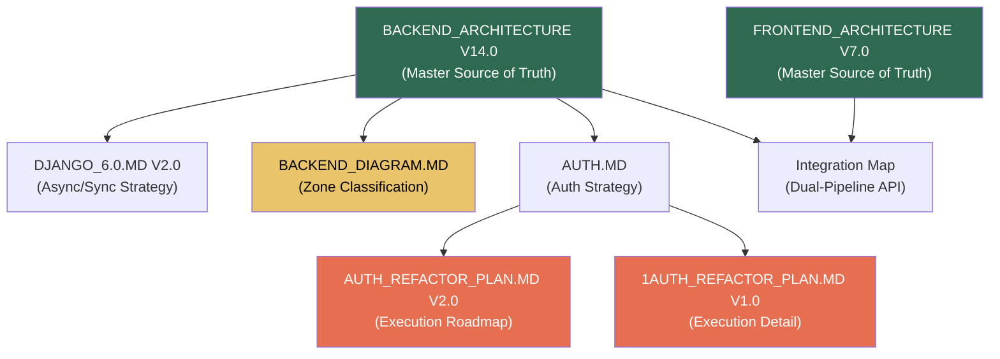
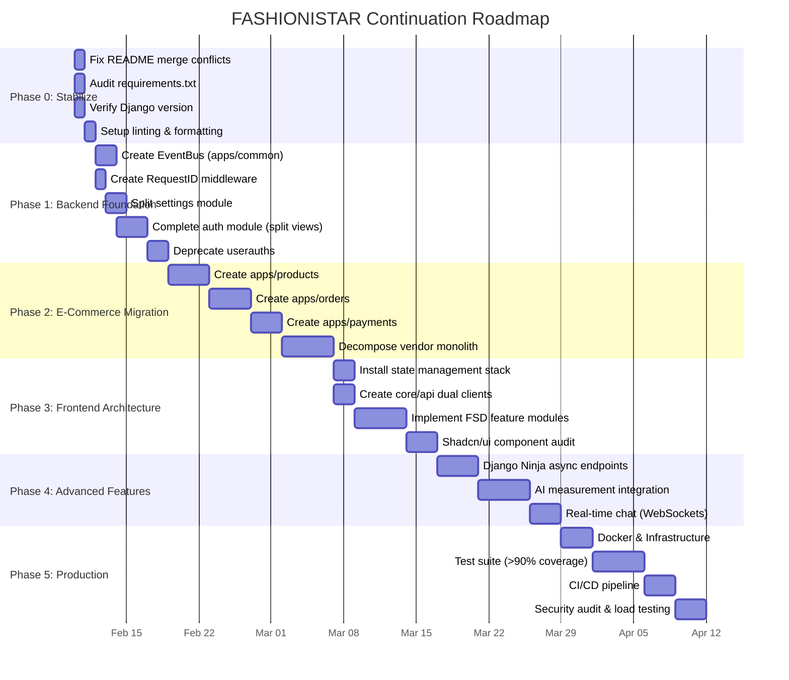
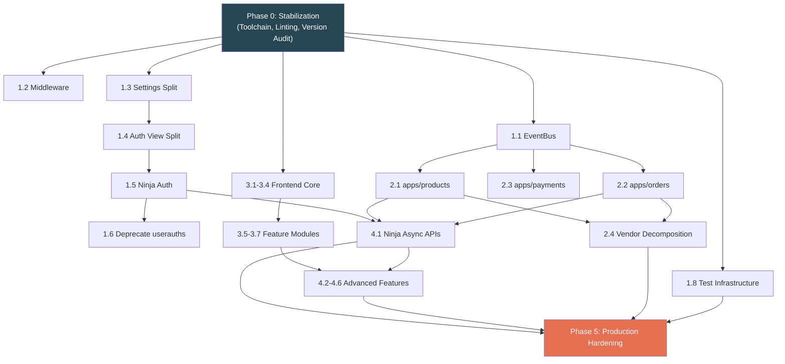

# 🗺️ AGENT_PLAN.MD — FASHIONISTAR AI: CONTINUATION PLAN

**Author:** Antigravity AI Agent (Senior Fullstack Architect)  
**Date:** February 10, 2026  
**Scope:** Full-Stack — `fashionistar_backend` (Django 6.0) + `fashionista_frontend` (Next.js 15)  
**Based On:** Exhaustive audit of 12 project markdown files + live directory/source analysis  
**Methodology:** Gap analysis between documented architecture (V14.0 Backend, V7.0 Frontend) and actual codebase state

---

## 📑 TABLE OF CONTENTS

1.  [Executive Summary & Situation Report](#1-executive-summary--situation-report)
2.  [Document Inventory & Cross-Reference Matrix](#2-document-inventory--cross-reference-matrix)
3.  [Gap Analysis: Architecture vs. Reality](#3-gap-analysis-architecture-vs-reality)
    - 3.1 [Backend Gap Heatmap](#31-backend-gap-heatmap)
    - 3.2 [Frontend Gap Heatmap](#32-frontend-gap-heatmap)
4.  [Prioritized Execution Roadmap](#4-prioritized-execution-roadmap)
    - Phase 0: Stabilization & Toolchain
    - Phase 1: Backend Foundation & Auth Completion
    - Phase 2: Core E-Commerce Domain Migration
    - Phase 3: Frontend Architecture Enforcement
    - Phase 4: AI, Real-Time & Advanced Features
    - Phase 5: Production Hardening & Go-Live
5.  [Detailed Task Breakdown (Per Phase)](#5-detailed-task-breakdown-per-phase)
6.  [Risk Registry & Mitigation](#6-risk-registry--mitigation)
7.  [Quality Gates & Acceptance Criteria](#7-quality-gates--acceptance-criteria)
8.  [Infrastructure & DevOps Checklist](#8-infrastructure--devops-checklist)
9.  [Dependency Graph](#9-dependency-graph)
10. [Appendix: Source Document Digest](#10-appendix-source-document-digest)

---

## 1. EXECUTIVE SUMMARY & SITUATION REPORT

### 1.1 Project Identity

**FASHIONISTAR AI** is an ambitious, AI-powered multi-vendor eCommerce platform targeting the African and global fashion market. The backend is a Django monolith undergoing modernization to Django 6.0 with a Dual-Engine API strategy (DRF Sync + Django Ninja Async). The frontend is a Next.js 15 application with Tailwind CSS v4 and Shadcn/ui.

### 1.2 Current State Assessment

> [!IMPORTANT]
> **The project has extensive architectural documentation but is in the EARLY STAGES of actual implementation toward that architecture.** There is a significant gap between the documented V14.0/V7.0 target state and the live codebase.

| Dimension | Documented State | Actual State | Gap Severity |
|---|---|---|---|
| **Backend: Modern `apps/` layer** | 5 domain modules (`auth`, `common`, `products`, `orders`, `payments`) | 2 modules exist (`authentication`, `common`) | 🔴 HIGH |
| **Backend: Legacy apps** | Should be deprecated/migrated | 15+ legacy apps still at root level (`vendor/`, `userauths/`, `store/`, `Homepage/`, `ShopCart/`, `checkout/`, `customer/`, `Blog/`, `chat/`, etc.) | 🔴 HIGH |
| **Backend: Django version** | Django 6.0 LTS | Currently on Django (version TBC via `requirements.txt`) | 🟡 MEDIUM |
| **Backend: Auth module** | 10-step dual-engine refactor complete | Partially implemented — services exist, but `views.py` is monolithic (36KB), legacy `userauths/` still present (35 files) | 🟡 MEDIUM |
| **Backend: Event Bus** | Signals banned, `EventBus` in `apps/common/events.py` | No `events.py` found in `apps/common/` | 🔴 HIGH |
| **Backend: Infrastructure** | Docker, PgBouncer, Redis Cluster, K8s manifests | No `docker/`, `infra/`, or `k8s/` directories present | 🔴 HIGH |
| **Backend: Tests** | >90% coverage, unit/integration/e2e | Scattered test files at root level (`test.py`, `test_*.py`), no `tests/` directory structure | 🔴 HIGH |
| **Frontend: FSD 2.0 structure** | `core/`, `features/`, `components/`, `lib/` layers | Flat `app/` structure with `components/`, `utils/`, `context/` — no FSD hierarchy | 🟡 MEDIUM |
| **Frontend: Dual API clients** | `client.sync.ts` (Axios) + `client.async.ts` (Ky) | No dedicated API client layer found | 🔴 HIGH |
| **Frontend: State management** | Zustand + TanStack Query + Nuqs | No Zustand stores, no TanStack Query, no Nuqs | 🔴 HIGH |
| **Frontend: CI/CD** | 4-stage pipeline with Playwright E2E | No CI/CD configuration present | 🔴 HIGH |

### 1.3 What HAS Been Done (Acknowledging Progress)

✅ `apps/authentication/` module created with services layer (`services/` — 20 files)  
✅ `apps/common/` module with permissions, exceptions, providers, managers, utils, renderers  
✅ Auth serializers implemented (20KB — comprehensive)  
✅ Auth models defined (`models.py` — 7.7KB)  
✅ Custom auth backends (`backends.py`)  
✅ Rate throttling (`throttles.py`)  
✅ Pydantic types started (`types/` directory — 2 files)  
✅ Auth URL routing defined (`urls.py` — 7.8KB)  
✅ Frontend basic pages: `(auth)`, `(home)`, `dashboard`, `admin-dashboard`  
✅ Frontend components library started (42 component files)  
✅ Custom font integration (Satoshi)  
✅ Comprehensive architectural docs written (45KB+ backend architecture alone)

---

## 2. DOCUMENT INVENTORY & CROSS-REFERENCE MATRIX

All existing project markdown documents were studied. The matrix below maps each document to the domain it governs and its relevance to the continuation plan.

| # | Document | Location | Size | Domain | Key Contribution |
|---|---|---|---|---|---|
| 1 | `BACKEND_ARCHITECTURE_JAN_2026.MD` | Backend root + Monorepo root | 45KB | Backend | **Master blueprint** — V14.0 Definitive Enterprise Standard (14 sections, 96-item checklist) |
| 2 | `FRONTEND_ARCHITECTURE_JAN_2026.MD` | Monorepo root + Frontend root | 28KB | Frontend | **Master blueprint** — V7.0 Final Enterprise Edition (15 sections, FSD 2.0, Dual-Pipeline) |
| 3 | `DJANGO_6.0.MD` (Backend) | Backend root | 13KB | Backend | Django 6.0 features, strict async/sync separation, 5 expert recommendations |
| 4 | `DJANGO_6.0.MD` (Frontend) | Frontend root | 15KB | Backend | Earlier V1.0 version of the backend Django 6.0 blueprint (overlaps with #3) |
| 5 | `AUTH.MD` | Backend root | 10KB | Auth | 10-step auth implementation plan with MFA, OAuth, audit logging, service layer |
| 6 | `AUTH_REFACTOR_PLAN.MD` | `apps/authentication/` | 7KB | Auth | V2.0 execution-phase roadmap — 10-step dual-engine auth with legacy analysis |
| 7 | `1AUTH_REFACTOR_PLAN.MD` | `apps/authentication/` | 6KB | Auth | V1.0 auth refactor execution — sections for Registration, OTP, Login, Password |
| 8 | `BACKEND_DIAGRAM.MD` | Backend root | 5KB | Backend | Directory tree visualization with Green/Yellow/Red zone classification |
| 9 | `README.md` (Backend) | Backend root | 2KB | Setup | Basic installation instructions (has git merge conflict markers) |
| 10 | `README.md` (Frontend) | Frontend root | 1KB | Setup | Stock Create Next App readme |
| 11 | `snippets.md` | Backend root | 1KB | Backend | `drf-yasg` Swagger configuration snippet |
| 12 | `README.md` (Fonts) | Frontend `/fonts/` | — | Assets | Font README (not relevant to continuation) |

### Cross-Reference Analysis

> [!NOTE]
> Documents #3 and #4 are **overlapping versions** of the same Django 6.0 blueprint. The backend copy (V2.0, 13KB) is the **canonical version** with the strict "No ADRF" rule. The frontend copy (V1.0, 15KB) is an earlier draft that still references ADRF—it should be superseded.

---

## 3. GAP ANALYSIS: ARCHITECTURE VS. REALITY

### 3.1 Backend Gap Heatmap

| Target Module | Architecture Section | Files Expected | Files Found | Status | Next Action |
|---|---|---|---|---|---|
| `apps/common/` | §5, §6.5 | `models.py`, `events.py`, `middleware.py`, `permissions.py`, `selectors.py`, `tasks.py` | `models.py` ✅, `permissions.py` ✅, `exceptions.py` ✅, `utils.py` ✅, `tasks.py` ✅, `renderers.py` ✅ | 🟡 **Missing:** `events.py`, `middleware.py`, `selectors.py` | Create EventBus, RequestID middleware, global selectors |
| `apps/authentication/` | §7, Auth docs | Full dual-engine APIs, services, types | Services ✅ (20 files), serializers ✅, models ✅, types ✅ (2 files), URLs ✅ | 🟡 **Partial:** Views are monolithic (36KB `views.py`), async Ninja path unclear | Split `views.py` into `apis/auth/sync_views.py` + `async_views.py`, verify Ninja integration |
| `apps/products/` | §5, §6.1, §6.2 | apis/, services.py, selectors.py, models.py | **NOT CREATED** | 🔴 | Migrate from `store/`, `Homepage/` |
| `apps/orders/` | §5, §6.2, §6.4 | apis/, services/, selectors.py, tasks.py | **NOT CREATED** | 🔴 | Migrate from `createOrder/`, `checkout/` |
| `apps/payments/` | §5, §6.4 | services/, apis/, tasks.py | **NOT CREATED** | 🔴 | Migrate from `Paystack_Webhoook_Prod/` |
| `config/settings/` | §5, §10 | base.py, production.py, development.py, logging.py, opentelemetry.py | Currently `backend/settings.py` (single file) | 🔴 | Split settings module |
| `docker/` | §10.2 | Dockerfile, docker-compose.yml, k8s/ | **NOT CREATED** | 🔴 | Create Docker infrastructure |
| `infra/` | §10.2 | pgbouncer/, monitoring/ | **NOT CREATED** | 🔴 | Create PgBouncer + monitoring configs |
| `tests/` | §13 | unit/, integration/, e2e/ | Scattered root-level test files only | 🔴 | Restructure test suite with pytest |
| `docs/` | §3 | architecture.md, api/, runbooks/ | Architecture docs at root level | 🟡 | Move docs to structured `docs/` folder |
| **Legacy: `userauths/`** | §5.1 (DEPRECATED) | Should be removed/merged | 35 files still present | 🔴 | Merge into `apps/authentication/`, deprecate |
| **Legacy: `vendor/`** | §5.1 (DEPRECATED) | Should be decomposed | 39 files, `views.py` 100KB+ monolith | 🔴 | Break into domain modules |

### 3.2 Frontend Gap Heatmap

| Target Layer | Architecture Section | Expected Structure | Actual Structure | Status | Next Action |
|---|---|---|---|---|---|
| `core/config/` | §4.5 | `env.mjs` with T3 Env + Zod | No `core/` directory exists | 🔴 | Create `core/config/env.mjs` |
| `core/api/` | §4.2 | `client.sync.ts` (Axios) + `client.async.ts` (Ky) | No API client layer | 🔴 | Build dual-pipeline API layer |
| `core/types/` | §3 | Global TS interfaces (Pydantic-generated) | Single `types.d.ts` in `src/` | 🟡 | Expand and organize types |
| `components/ui/` | §4.1 | Shadcn primitives | 42 components exist in `app/components/` | 🟡 | Audit and reorganize to FSD standard |
| `components/providers/` | §4.3 | QueryProvider, AuthProvider, ThemeProvider | Single `context/` directory | 🟡 | Create proper providers |
| `features/auth/` | §3, §4.4 | components/, services/, store/, schemas/ | `(auth)/` route group exists | 🟡 | Implement feature-sliced auth module |
| `features/shop/` | §3 | Product domain with Nuqs hooks | `(home)/` has some product pages | 🟡 | Restructure to FSD |
| `lib/utils.ts` | §4.1 | `cn()` utility with `twMerge` | Exists in `app/utils/` | 🟡 | Move to `lib/` |
| State: Zustand | §4.3 | Auth store, Cart store | **NOT INSTALLED** | 🔴 | Install + implement stores |
| State: TanStack Query | §4.3 | QueryClient, QueryProvider | **NOT INSTALLED** | 🔴 | Install + configure |
| State: Nuqs | §4.3 | URL-driven filter state | **NOT INSTALLED** | 🔴 | Install + implement |
| Testing: Vitest | §10 | Unit tests for schemas | **NOT CONFIGURED** | 🔴 | Setup Vitest |
| Testing: Playwright | §10 | E2E test suite | **NOT CONFIGURED** | 🔴 | Setup Playwright |
| `middleware.ts` | §12 | CSP headers, route protection | File exists (empty or minimal) | 🟡 | Implement security headers |

---

## 4. PRIORITIZED EXECUTION ROADMAP

> [!IMPORTANT]
> **Execution Philosophy:** We proceed in dependency order. Foundation before features. Backend before frontend integration. Each phase has a defined "Definition of Done" gate.

---

## 5. DETAILED TASK BREAKDOWN (PER PHASE)

### Phase 0: Stabilization & Toolchain (Days 1–2)

| # | Task | Priority | Effort | Deliverable |
|---|---|---|---|---|
| 0.1 | Fix `README.md` git merge conflict markers | P0 | 15min | Clean README |
| 0.2 | Audit `requirements.txt` — verify Django/Python versions, remove deprecated packages | P0 | 1h | Updated `requirements.txt` |
| 0.3 | Verify actual Django version running; document upgrade path if not 6.0 | P0 | 30min | Version report |
| 0.4 | Setup `ruff` (linter) + `black` (formatter) + `mypy` (type checker) | P1 | 2h | `pyproject.toml` configuration |
| 0.5 | Create `.env.example` from existing `.env` (redact secrets) | P1 | 30min | `.env.example` |
| 0.6 | Consolidate duplicate architecture docs (remove frontend `DJANGO_6.0.MD` V1.0; keep backend V2.0 as canonical) | P2 | 30min | Single source of truth |

---

### Phase 1: Backend Foundation & Auth Completion (Days 3–9)

| # | Task | Priority | Effort | Deliverable |
|---|---|---|---|---|
| 1.1 | **Create `apps/common/events.py`** — Implement `EventBus` class with async emit/subscribe as defined in Architecture §6.5 | P0 | 3h | Working EventBus with unit tests |
| 1.2 | **Create `apps/common/middleware.py`** — RequestID injection, CSP nonce, timing middleware | P0 | 2h | Middleware chain |
| 1.3 | **Split `backend/settings.py`** into `config/settings/{base,development,production,logging}.py` | P0 | 4h | Modular settings |
| 1.4 | **Split `apps/authentication/views.py`** (36KB monolith) into: `apis/auth_views/sync_views.py`, `apis/auth_views/async_views.py`, `apis/password_views/sync_views.py`, `apis/password_views/async_views.py` | P0 | 6h | Clean view separation |
| 1.5 | **Wire Django Ninja** for `apps/authentication/` V2 async endpoints | P0 | 4h | Working async auth endpoints |
| 1.6 | **Merge `userauths/` into `apps/authentication/`** — map legacy models/views to new structure, create migration script | P1 | 8h | Legacy deprecation |
| 1.7 | **Create `apps/common/selectors.py`** — base selector patterns | P2 | 2h | Reusable query patterns |
| 1.8 | Setup `pytest` + `pytest-django` + `pytest-asyncio` in organized `tests/` directory | P1 | 3h | Test infrastructure |

---

### Phase 2: Core E-Commerce Domain Migration (Days 10–22)

| # | Task | Priority | Effort | Deliverable |
|---|---|---|---|---|
| 2.1 | **Create `apps/products/`** — Migrate from `store/`, `Homepage/` (product.py, brand.py, category.py, collections.py) | P0 | 12h | Product domain module with models, services, selectors, APIs |
| 2.2 | **Create `apps/orders/`** — Migrate from `createOrder/`, `checkout/`, `ShopCart/` | P0 | 12h | Order domain module with async Ninja APIs |
| 2.3 | **Create `apps/payments/`** — Migrate from `Paystack_Webhoook_Prod/` with SELECT FOR UPDATE pattern | P0 | 8h | Payment domain module with webhook idempotency |
| 2.4 | **Decompose `vendor/views.py`** (100KB+ monolith) into granular services, selectors, and API endpoints distributed across domain modules | P1 | 16h | Zero monolithic views |
| 2.5 | **Migrate `customer/`** — wallet, wishlist, reviews, profile into appropriate domain modules | P1 | 6h | Customer logic distributed |
| 2.6 | **Migrate `admin_backend/`** — chat_view, order_view, delivery into admin-specific APIs | P1 | 4h | Admin dashboard APIs |
| 2.7 | **Migrate `notification/`** — vendor/client notifications with EventBus integration | P2 | 4h | Notification service |
| 2.8 | **Migrate `Blog/`** — if needed, create `apps/content/` or keep as minimal standalone | P3 | 2h | Content module |
| 2.9 | **Migrate `measurements/`** — AI body measurement to `apps/measurements/` with Ninja async | P2 | 4h | AI measurement module |

---

### Phase 3: Frontend Architecture Enforcement (Days 23–32)

| # | Task | Priority | Effort | Deliverable |
|---|---|---|---|---|
| 3.1 | **Install core dependencies**: `zustand`, `@tanstack/react-query`, `nuqs`, `ky`, `zod`, `sonner`, `framer-motion`, `@t3-oss/env-nextjs` | P0 | 1h | Updated `package.json` |
| 3.2 | **Create `src/core/`** directory structure: `config/env.mjs`, `api/client.sync.ts`, `api/client.async.ts`, `types/`, `monitoring/` | P0 | 4h | Infrastructure layer |
| 3.3 | **Create `src/lib/utils.ts`** with `cn()` utility | P0 | 30min | Utility function |
| 3.4 | **Create `src/components/providers/`** — `query-provider.tsx`, `auth-provider.tsx`, `theme-provider.tsx` | P0 | 3h | React context providers |
| 3.5 | **Implement `src/features/auth/`** — FSD module with `components/`, `services/`, `store/auth.store.ts`, `schemas/login.schema.ts` | P0 | 6h | Auth feature module |
| 3.6 | **Implement `src/features/cart/`** — Cart store with Zustand persistence | P1 | 3h | Cart feature module |
| 3.7 | **Implement `src/features/shop/`** — Product listing with TanStack Query, Nuqs filters, infinite scroll | P1 | 8h | Shop feature module |
| 3.8 | **Audit and reorganize existing 42 components** — move to `components/ui/`, `components/shared/`, `components/layouts/` | P1 | 4h | Clean component tree |
| 3.9 | **Implement `src/middleware.ts`** — CSP headers, auth route protection, rate limiting | P1 | 2h | Security middleware |
| 3.10 | **Configure `next.config.mjs`** — enable PPR, React Compiler, image optimization | P2 | 1h | Optimized Next.js config |

---

### Phase 4: AI, Real-Time & Advanced Features (Days 33–42)

| # | Task | Priority | Effort | Deliverable |
|---|---|---|---|---|
| 4.1 | **Implement Django Ninja async endpoints** for: Product search, Order creation, Dashboard stats | P0 | 12h | High-performance async APIs |
| 4.2 | **Integrate PgVector** for AI product embeddings + similarity search | P1 | 6h | Vector search infrastructure |
| 4.3 | **AI measurement widget** — frontend camera access + backend processing endpoint | P2 | 12h | AI sizing feature |
| 4.4 | **Real-time chat** via Django Channels (WebSocket consumers) | P2 | 8h | Live chat system |
| 4.5 | **Google OAuth integration** — backend `google_service.py` + frontend NextAuth.js SSR | P1 | 6h | Social login |
| 4.6 | **Notification system** — FCM integration + in-app notification center | P2 | 6h | Push notifications |

---

### Phase 5: Production Hardening & Go-Live (Days 43–53)

| # | Task | Priority | Effort | Deliverable |
|---|---|---|---|---|
| 5.1 | **Create `docker/Dockerfile`** — multi-stage optimized build | P0 | 3h | Production Docker image |
| 5.2 | **Create `docker/docker-compose.yml`** — local dev with Redis, PostgreSQL, PgBouncer | P0 | 3h | Local development orchestration |
| 5.3 | **Create `infra/pgbouncer/`** — PgBouncer configuration (transaction mode, 10K max connections) | P0 | 2h | Connection pooling |
| 5.4 | **Achieve >90% backend test coverage** — unit (pytest), integration (pytest-asyncio), e2e | P0 | 16h | Test suite |
| 5.5 | **Frontend testing** — Vitest unit tests + Playwright E2E | P1 | 8h | Frontend test suite |
| 5.6 | **CI/CD pipeline** — GitHub Actions: lint → test → build → staging → canary production | P0 | 4h | `.github/workflows/ci.yml` + `cd.yml` |
| 5.7 | **Security audit** — CSP validation, HSTS, dependency scanning, OWASP top 10 review | P0 | 6h | Security report |
| 5.8 | **Load testing** — target 1,500 RPS on async endpoints, <100ms p95 response time | P1 | 4h | Load test results |
| 5.9 | **OpenTelemetry + structured logging** — Jaeger tracing, JSON logs with request_id | P1 | 4h | Observability stack |
| 5.10 | **Kubernetes manifests** (if deploying to K8s) — deployments, HPA, services | P2 | 4h | K8s infrastructure |

---

## 6. RISK REGISTRY & MITIGATION

| Risk | Likelihood | Impact | Mitigation |
|---|---|---|---|
| **Django 6.0 not yet released / breaking changes** | Medium | High | Pin to latest LTS; maintain compatibility layer; verify `django.core.tasks` availability |
| **Legacy `vendor/views.py` decomposition introduces regressions** | High | High | Write integration tests BEFORE migration; use feature flags; maintain backward-compatible URL routing |
| **`userauths` → `apps/authentication` data migration breaks user accounts** | Medium | Critical | Create reversible data migration; backup DB before execution; test on staging first |
| **Frontend state management overhaul causes UI regressions** | Medium | Medium | Implement incrementally per feature-slice; maintain existing functionality during transition |
| **Async/sync boundary contamination** | Medium | High | Enforce strict linting rules; `mypy` checks; code review gate on all PR merges |
| **PgBouncer misconfiguration under load** | Low | High | Load test with realistic traffic profiles before production cutover |

---

## 7. QUALITY GATES & ACCEPTANCE CRITERIA

### Per-Phase Exit Criteria

| Phase | Gate | Metric |
|---|---|---|
| **Phase 0** | All linting passes | `ruff check .` → 0 errors |
| **Phase 1** | Auth endpoints functional (sync + async) | All 4 flows pass (Register, OTP, Login, Password Reset) on both engines |
| **Phase 2** | Core CRUD operational | Products, Orders, Payments API contracts match OpenAPI spec |
| **Phase 3** | Frontend hydrates without errors | `next build` succeeds; Lighthouse Performance > 80 |
| **Phase 4** | AI/RT features demo-ready | Measurement endpoint returns valid embeddings; chat sends/receives |
| **Phase 5** | Production checklist complete | ≥90% of the 96-item checklist from Architecture §13 verified |

### Code Quality Standards (Non-Negotiable)

- **Backend:** 100% type hints (mypy strict), Google-style docstrings, structured JSON logging, no Django signals
- **Frontend:** TypeScript strict mode, Zod validation on all API responses, no barrel files, `cn()` utility for class merging
- **Both:** No `any` types, meaningful error messages, audit trail on auth events

---

## 8. INFRASTRUCTURE & DEVOPS CHECKLIST

| Item | Status | Phase |
|---|---|---|
| Python 3.12+ verified | ⬜ TBC | 0 |
| Django 6.0 installed & configured | ⬜ | 0 |
| PostgreSQL 14+ with PgVector extension | ⬜ | 1 |
| Redis (cluster mode or Sentinel HA) | ⬜ | 1 |
| PgBouncer (transaction mode) | ⬜ | 5 |
| Uvicorn ASGI server | ⬜ | 1 |
| Docker multi-stage build | ⬜ | 5 |
| Docker Compose (local dev) | ⬜ | 5 |
| GitHub Actions CI/CD | ⬜ | 5 |
| Sentry error tracking (backend + frontend) | ⬜ | 5 |
| OpenTelemetry tracing | ⬜ | 5 |
| SSL/TLS + HSTS | ⬜ | 5 |
| CSP headers (Django + Next.js) | ⬜ | 3/5 |
| Vercel deployment (frontend) | ⬜ | 5 |
| Render/AWS deployment (backend) | ⬜ | 5 |

---

## 9. DEPENDENCY GRAPH

The following diagram shows the execution dependency chain. Tasks at the top must complete before those below.

---

## 10. APPENDIX: SOURCE DOCUMENT DIGEST

### A. Architecture Principles Summary (From All Documents)

1. **Dual-Engine API:** DRF (Sync/CRUD) + Django Ninja (Async/AI/Real-Time) — NO ADRF wrappers
2. **Native Async ORM:** `aget()`, `acreate()`, `afilter()`, `aall()` only — no `sync_to_async` for DB calls
3. **Mandatory Concurrency:** `asyncio.gather()` for 2+ independent I/O operations
4. **Event-Driven Core:** EventBus replaces all Django signals
5. **Transactional Integrity:** `transaction.on_commit()` before enqueuing background tasks
6. **Type Strictness:** 100% type hints, mypy-enforced, no `Any`
7. **Security by Default:** CSP, HSTS, JWT (15min/7day), 6-layer defense-in-depth
8. **Frontend: Trinity State:** Zustand (client) + TanStack Query (server) + Nuqs (URL)
9. **Frontend: Dual Pipeline:** Axios→DRF (sync) + Ky→Ninja (async) — strict separation
10. **Frontend: FSD 2.0:** Feature-Sliced Design with `core/`, `features/`, `components/`, `lib/`

### B. Legacy Apps Requiring Migration

| Legacy App | Files | Target Destination | Complexity |
|---|---|---|---|
| `userauths/` | 35 | `apps/authentication/` | 🔴 High (duplicate user model) |
| `vendor/` | 39 | `apps/products/`, `apps/orders/`, `apps/payments/` | 🔴 High (100KB+ monolith) |
| `store/` | 9 | `apps/products/` | 🟡 Medium |
| `Homepage/` | 13 | `apps/products/` | 🟡 Medium |
| `customer/` | 16 | Multiple domain modules | 🟡 Medium |
| `checkout/` | 9 | `apps/orders/` | 🟢 Low |
| `createOrder/` | 8 | `apps/orders/` | 🟢 Low |
| `ShopCart/` | 10 | `apps/orders/` (cart sub-module) | 🟢 Low |
| `Paystack_Webhoook_Prod/` | 19 | `apps/payments/` | 🟡 Medium |
| `admin_backend/` | 26 | Admin-specific views in domain modules | 🟡 Medium |
| `Blog/` | 9 | `apps/content/` (optional) | 🟢 Low |
| `chat/` | 11 | `apps/chat/` (keep, modernize) | 🟡 Medium |
| `notification/` | 11 | `apps/notifications/` | 🟡 Medium |
| `measurements/` | 9 | `apps/measurements/` | 🟡 Medium |
| `addon/` | 7 | Evaluate necessity | 🟢 Low |
| `api/` | 8 | Merge into domain APIs | 🟢 Low |

### C. Performance Targets (From Architecture §8)

| Metric | Target |
|---|---|
| API Response Time (p95) | < 100ms |
| API Throughput | 1,500 RPS |
| Database Connections (via PgBouncer) | Max 50 active |
| Task Latency (p95) | < 2s |
| Memory per Pod | < 350MB |
| Frontend LCP | < 1.0s |
| Frontend INP | < 75ms |
| Lighthouse Score | > 95 |

---

> [!CAUTION]
> **This plan is a living document.** It will be updated as phases are completed, blockers are discovered, and priorities shift based on business needs. Each phase completion triggers a checkpoint review.

---

**Prepared by:** Antigravity AI Agent  
**Next Immediate Action:** Await approval, then begin **Phase 0, Task 0.1** (README cleanup) and **Task 0.2** (requirements.txt audit).
